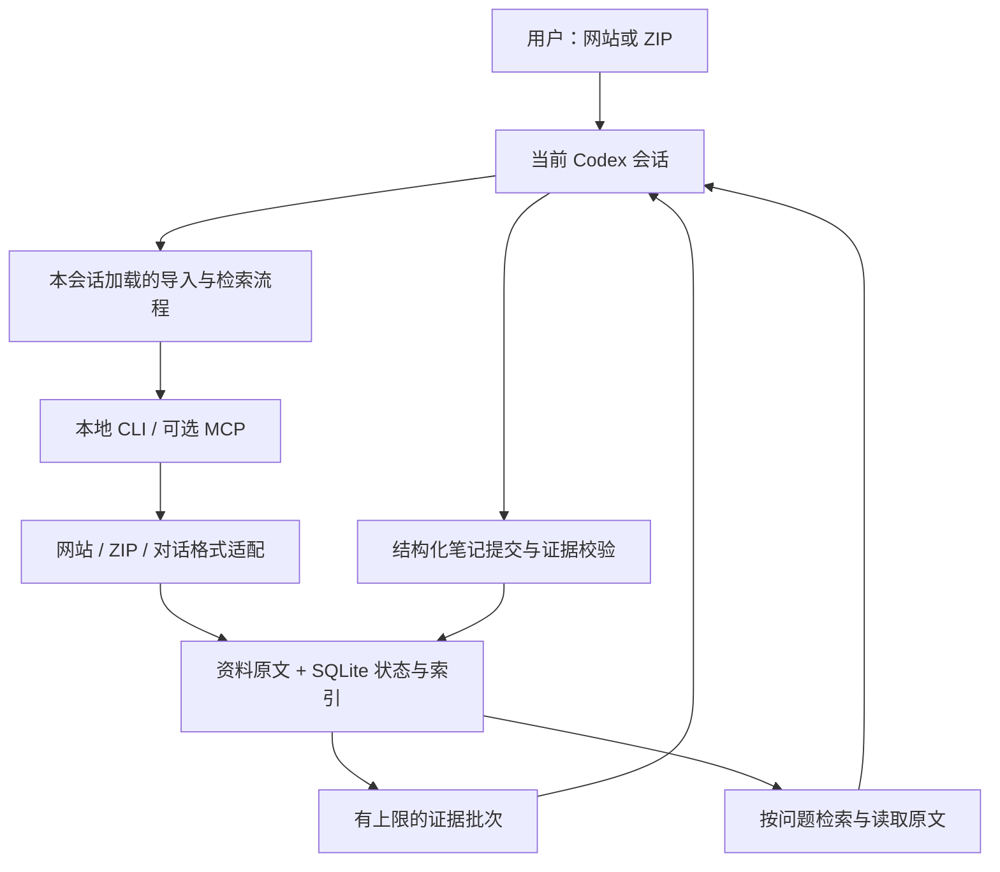

# 给 Codex 一个网站或 ZIP，让资料以后仍然可用

设计日期：2026-09-14。状态：文档中的 MVP 已实现；后续扩展仍是设计方案。已按用户对影响范围的要求，保持默认单会话手动加载。

基于 The Way Here 的 `e0f711257514a7e7e995359b3c67275e0ae48199` 快照、本机 Codex CLI `0.146.0` 的命令帮助，以及当日 OpenAI 官方文档。实际已交付范围以仓库 README 为准；本文还包含后续设想。

## 先看这部分

推荐做一个可在当前会话手动加载的本地资料工具包，暂名 `the-way-here`。准备好后，在想使用的会话里明确加载入口文件，再直接说：

> 把这个 ZIP 收进资料库，以后问到时用它。
>
> 把这个网站的文档收进来。
>
> 结合我之前的资料，看看这次有什么不同。

工具包负责保存和搜索，当前 Codex 负责理解和回答。换任务后，资料仍可保留，但新任务必须再次明确加载并选中同一库；不用重新上传原始资料。默认不注册全局 Skill、MCP、Hook 或自动读取规则。

默认先把资料变成可搜索原文，再按需形成有出处的主题笔记。这样大文件不会一直卡在“AI 整理中”。

第一版支持网站与 ZIP，提供查原文、继续整理、更新资料、移除资料和导出备份。全量自动记录聊天、云同步、照片认人和复杂可视化后置。

## 1. 需求怎样落到具体行为

| 你关心的事 | 设计决定 |
| --- | --- |
| 只想交一个网站或 ZIP | 接收 URL 或本地附件路径；自动判断格式，不要求填表或先整理目录 |
| 不想反复告诉 Codex 背景 | 库独立保存；新任务明确加载同一库后可复用资料 |
| 担心影响其他会话 | 默认仅在明确加载的会话中调用，不写全局配置或自动发现目录 |
| 不想被长说明打断 | 正常结果用三行：收进多少、还有什么未完成、现在能做什么 |
| 想知道回答靠不靠谱 | 重要结论带原文位置；区分资料事实、用户自述与模型推断 |
| 资料多、可能随时离开 | 已保存的资料立即可查，未完成部分记录进度，下次接着处理 |
| 可以是个人经历，也可以是网站文档 | 按来源和主题组织；不会把网站作者或历史 AI 的话归到你身上 |

“给一个链接”默认是让 Codex 查看。只有“收进来、导入、以后用”等明确意图才持久保存。首次安装的授权不等于允许保存以后所有聊天。

默认自动保存用户明确提交导入的资料，以及这次导入直接生成的有据笔记；普通聊天只在明确要求记住时保存。这是设计默认值，用户尚未选择全量或选择性自动捕获。

### 生效范围：默认单会话，项目级可选

| 模式 | 怎么启用 | 影响范围 |
| --- | --- | --- |
| **单会话手动加载（默认）** | 在当前会话明确要求读取工具包的 `LOAD.md`，绑定一个资料库 | 本会话按需调用本地 CLI；其他会话不自动加载这份说明或连接工具 |
| 专用项目 | 在一个独立项目放项目级 Skills 与 MCP 配置 | 该项目范围内的会话都可能加载；其他项目不因这套项目配置加载 |
| 全局插件 | 用户另行明确选择后注册 | 用户级范围；本次不采用 |

单会话模式的工具包放在普通目录，入口不放入 `.agents/skills`、用户 Skill 目录、项目 `AGENTS.md` 或自动发现的插件目录。当前 Codex 读取入口后，用现有 shell 能力运行工具包 CLI；无需在桌面端动态增加一个会话专属 MCP。

这属于工作流程和自动加载范围的隔离，不是操作系统访问控制：其他拥有相同磁盘权限的任务仍可能在用户明确要求下读取该目录。当前会话若被恢复、分叉或复制，其已加载说明也可能随历史保留。说“停用资料库”后停止调用，但已读进上下文的内容不能从现有对话中抹掉；需要干净上下文时新建不加载的任务。Codex 自身的其他记忆功能属于独立配置，本工具包不代为修改。

官方确认 Skills 和 MCP 有项目级配置；本机 CLI 还支持仅本次启动的 `-c` 配置覆盖。但这不证明桌面端有一个通用的“仅此会话安装插件”开关，所以默认使用手动入口加 CLI 的可实现路径。[Skills 作用域](https://learn.chatgpt.com/docs/build-skills#where-codex-loads-local-skills) · [项目级 MCP](https://learn.chatgpt.com/docs/extend/mcp?surface=cli) · [配置优先级](https://learn.chatgpt.com/docs/config-file/config-basic)

## 2. 三种接法，选择中间复杂度

| 方案 | 能得到什么 | 主要代价 | 结论 |
| --- | --- | --- | --- |
| 只装 Skill，直接读写文件 | 最快验证“给资料、问资料” | 去重、并发、版本、删除与检索依赖每次模型临场处理 | 可做短期原型，不作为最终交付 |
| 会话入口 + 本地 CLI/MCP + 持久资料库 | 在明确启用的范围调用稳定工具 | 需要实现导入、索引和状态管理；CLI 与 MCP 共用核心 | **推荐：默认 CLI，项目级按需接 MCP** |
| MCP 包装原 Web 服务的 HTTP API | 较快沿用现有页面与导入流程 | 要启动整个 Studio；保留另一层 Agent 调度；还缺网站入口和合适的中文检索 | 只适合已有 Studio 重度用户 |

CLI 是当前 Codex 通过 shell 调用功能的命令入口；MCP 是可选的工具接口。两者共用核心，不再启动另一个 Codex，也不另接付费模型 API。正常使用消耗当前 Codex 会话的模型额度；抓取、解包和建索引在本地完成。

## 3. 用户实际看到什么

### ZIP 资料包

1. 你发 ZIP 并说“收进来”。Codex 获取附件实际可访问的本地路径。
2. 插件扫描目录和内容特征，识别日记、笔记、网页导出、ChatGPT/Claude 对话等。
3. 支持的内容先落盘、去重、建索引，再分批提取主题与事件。
4. 只报告真实结果。例如：

> 已收进 126 份资料，跳过 8 个重复文件。
> 3 张图片暂未识别；人物和主题整理完成 42/126 份。
> 已收进的内容现在就能问；说“继续整理”可接着处理。

这是示例文案，不是本次实际导入结果。附件必须能被当前本地 Codex 环境读取；若宿主只给了远端附件引用，先通过宿主支持的下载能力取回。MCP 本身不能读取聊天 UI 中没有交付给它的文件。

### 网站

1. 你给链接并说“收进来”。文章详情页默认收该页。
2. 你说“这个网站/这套文档”时，以给定入口的同源、同目录范围收集正文链接；首批最多 50 页、链接深度最多 2。
3. 保存网页标题、最终 URL、抓取时间和正文快照。报告收录范围、成功数、失败数、是否触及上限。
4. 后续“更新这个网站”重新抓取原范围，只处理变化的页面。

超过首批上限时保留剩余链接清单，用户可以说“继续收录”。首页是网站入口时范围可覆盖同源路径；具体文档子目录只覆盖该目录。导航、搜索、登录、退出、表单操作页不进入资料范围。站点地图仅用于发现该范围内的候选链接。

首版抓取公开静态 HTML 和纯文本。需要登录或前端渲染才能得到正文时，先报告具体页面；当前宿主有浏览器/连接器且用户已有访问权限时，可由 Codex 取回可见正文再提交。不可用时接受该页的 HTML/Markdown 导出，不声称整个网站已导入。

### 换一个任务再问

先说“加载来时路，使用上次的资料库”，再问“我上次为什么放弃那个方案”。Codex 通过已加载的检索流程找到相关记录，读取证据，再简短回答。查到多少就回答多少；没有命中时不会伪造记忆。

未加载的任务不因为出现“之前、我上次”等词就启用本工具包。在已加载任务中，相关需求才调用检索；保留明确入口：“用来时路资料库回答……”。

## 4. 架构：由当前 Codex 完成理解



边界固定如下：

| 组件 | 负责 | 不承担 |
| --- | --- | --- |
| Codex / 会话入口 | 明确绑定库、理解请求、选择证据、生成回答和笔记 | 解压与并发写入的底层正确性 |
| Import adapters | 取回内容、解码、保留来源与角色、输出统一记录 | 人生判断、归因、模型调用 |
| Memory store | 去重、版本、事务、证据引用、删除与任务进度 | 自动把文本判成真相 |
| Retriever | 中文检索、过滤、排序、限制返回长度 | 编造综合结论 |
| CLI / MCP adapter | 参数校验、调用上述模块、结构化错误 | 调用原项目的 `/api/runs` 或另起 Agent |

实现选择 TypeScript，沿用可提取的解析逻辑；SQLite 管理状态和索引，原始大文本/文件保存在独立内容目录。首个安装目标是用户当前的 macOS ARM64；其他平台通过同一套验收后再发布。

默认每次 CLI 调用启动短进程，显式携带本会话选定的数据根目录，返回 JSON 后退出。可选的项目级 MCP 使用本地 stdio。两种入口均无独占的内存状态，并发正确性在持久层实现。它们都依赖当前机器的文件访问能力，不能直接等同于 ChatGPT 网页端云插件。[官方 MCP 文档](https://learn.chatgpt.com/docs/extend/mcp?surface=cli)

## 5. 导入过程的状态与恢复

每次导入分成两条进度，避免把“原文可用”与“已经理解完”混在一起：

```text
来源入库：received → inspecting → importing → indexed / partial / failed
知识整理：pending → enriching → ready / paused / needs_attention
```

每个文件或网页独立记录结果。一个文件失败，不撤销已完成的其他文件。批次达到上限是 `partial`，不是成功收完。

ZIP 开始处理前先复制到库内暂存区并校验，后续按条目恢复，避免附件临时路径消失。复制未完成且原附件不可访问时明确要求重新提供原包。导入完成后清理暂存 ZIP，只保留已接纳文件与导入清单；不把整个压缩包永久重复保存。网页按页恢复，未抓完的单页重新请求；首版不承诺网络字节级续传。

本地抓取和解析通过短步骤推进，每次工具调用有时间与字节上限。大型工作将断点写入数据库，由当前 Codex 继续调用；关闭会话后保留断点，不承诺有一个仍在工作的后台 AI。

知识整理由当前 Codex 逐批取证据并提交。每批最多约 12,000 个原文字符，结果条数最多 20 条；原文总量超过 120,000 字符时，默认先完成检索入库和前 10 批整理，明确报告剩余量。只有用户已明确要求完整处理时才继续遍历全部；中断和限额耗尽同样保留断点。

以上是初始预算，需要用真实资料包调优。不能把字符数直接声称为精确 token 数或模型费用。

每批有 `batch_id`、`source_version_ids`、租约和游标。提交必须对应已领取批次；成功后才推进游标。重复提交同一个操作返回已有结果。租约过期后可被另一任务续领，旧租约的迟到提交被拒绝。

## 6. 输入支持与解析规则

| 输入 | 第一版处理 | 边界 |
| --- | --- | --- |
| ZIP 中的 Markdown / TXT | 保留目录、标题、原文；按段落和标题分块 | 编码无法可靠识别时记录失败，不用乱码生成笔记 |
| ZIP 中的 HTML | 提取正文与标题，保留原始文件 | 不执行脚本，不加载外部资源 |
| ChatGPT / Claude 导出 JSON | 按会话与消息解析，保留角色和时间 | 只对已验证结构启用专用适配器 |
| 其他 JSON | 尝试已知模式，否则保留为普通参考来源 | 不将任意 JSON 标成“已识别聊天” |
| ZIP 中的图片、PDF、Office、音视频 | 记录文件清单与跳过原因 | 首版不做 OCR、文档转换或转写 |
| 普通网页 | 抓取正文和来源快照 | 对动态/受限页提供明确降级结果 |
| 同站文档集合 | 在声明范围内分页收录，可继续 | 不自动跟随到其他站点 |

首版产品限额：单 ZIP 500 MiB、实际解压总量 2 GiB、20,000 个条目、单文本文件 10 MiB。网页响应单页 5 MiB、站点任务下载累计 100 MiB。达到任一限制即停止相应步骤并保存已完成进度；限额不是对所有该规模资料包处理速度的承诺。

解包必须流式计数，在解压过程中限制输出。拒绝越界路径、符号链接、加密或损坏包；不执行包内脚本，不递归打开嵌套压缩包。忽略系统垃圾文件并报告不支持的条目。不能依赖压缩头声称的解压大小。

网站请求只允许 HTTP(S)，逐次校验跳转与解析出的地址，默认拒绝回环、内网、链路本地和云元数据地址，防止页面把抓取器引向本机服务。遵守站点访问限制、限速和 robots 策略。内部站点在后续通过明确配置或现有连接器接入。

ChatGPT 的分支会话不能按时间把所有分支揉成一段：保留消息树；有可识别当前节点时沿其父链取主分支，其余保留为单独分支；主分支不明确时标注分支未知。历史 assistant/system/tool 文本是资料，不是用户自述，也不成为当前指令。

## 7. 资料与“记忆”分两层

### 原始资料层：可查的证据

统一记录 `SourceDocument` 至少包含：

| 字段 | 含义 |
| --- | --- |
| `library_id`, `source_id`, `version_id` | 所属资料库、稳定来源 ID、不可变内容版本 |
| `origin_kind`, `origin_uri`, `original_path` | 网页/附件/聊天来源与原始位置 |
| `content_hash`, `normalizer_version` | 检测重复、支撑重建与版本差异 |
| `title`, `author`, `speaker_role` | 标题、作者和消息角色；未知就留空 |
| `event_time`, `published_at`, `imported_at` | 事件、发布时间、导入时间分别保存 |
| `ownership` | `user_declared` / `external` / `unknown` |
| `status`, `revision` | 可用、被替代或删除，以及并发版本 |

上传资料不自动证明作者就是你。网站默认 `external`；笔记包只有你明确说“我的日记”才标记为用户来源；聊天导出保留 role，但没有身份映射时不认定其中的 user 就是当前用户。

正文分块保存 `chunk_id`、原文版本、段落/消息定位与精确引用范围。搜索归一化单独进行；证据位置对应不再变动的规范原文，使用 UTF-8 字节区间，避免中文和 emoji 的偏移错误。

### 整理层：有出处的笔记

`MemoryNote` 包含 `note_id`、类型、简短内容、实体 ID、证据引用、有效时间、状态和修订号。

笔记类型只保留四类：事件、用户明确偏好、主题摘要、待核实推断。网站摘要属于主题资料；从资料推测出的性格或动机不能升级成用户事实。

事实与推断的处理不同：直接转述必须有证据；推断用明确标签，默认不进入简短个人背景。一次提及先作为候选实体，同名或别名不充分时分别保留，不自动合并人物。

每条笔记至少引用一个具体原文片段。服务端检查 ID、版本、权限范围与引文是否真实存在；这只能证明“引文存在”，不能机械证明“结论被引文支持”。是否夸大、错归因、忽略否定，由 Skill 规则与评测集共同约束。

## 8. 存储、去重、更新与删除

建议每个独立资料空间使用 `~/Library/Application Support/the-way-here/spaces/<随机空间ID>/`。在当前会话首次显式加载时创建或指定，将绝对路径作为本会话绑定；不把默认库写入全局 Codex 配置，也不自动扫描其他空间。随机 ID 用于组织数据，不作为访问控制凭证。

```text
<data-root>/
  config.json                 # 库配置、读取范围与用户选择
  libraries/<library-id>/
    memory.sqlite             # 唯一的结构化状态、笔记、进度和检索索引
    objects/<content-hash>    # 原始文件与规范原文，不可变
    staging/                 # 未完成导入的暂存数据
    exports/                 # 用户主动导出的 Markdown / 备份
```

首次导入在已绑定空间创建一个默认资料库，每批输入同时形成一个可单独移除的资料集合。查询只覆盖该空间里明确选定的库；未绑定时 `memory_status` 返回“尚未加载资料库”，不列出本机所有空间。复用旧资料需要在新会话明确选择对应空间。

数据库是结构化数据的唯一写入入口；Markdown 是可导出视图，不做数据库与 Markdown 双向同步。源正文对象不能只靠索引恢复；备份必须包含数据库和被引用的对象。

新对象先写临时文件、校验哈希并原子改名，再提交数据库引用及索引。崩溃留下的孤立对象可以回收，不能出现已提交引用指向半个文件。重启时检查待办和孤立对象，恢复到可继续状态。

同一库内相同原始字节复用对象，内容相同但出处不同仍保留各自来源关系；同包再次导入返回幂等结果。同一网页 URL 内容变化产生新版本，旧版本保留供历史查询；不以重新下载时间覆盖事件日期。URL 只移除已知追踪参数，业务查询参数保留。

网页旧版本生成的笔记标记待复核；用户问“最新”时默认查询当前版本，问“以前”时可查历史。原链接失效不影响已保存快照，并显示抓取日期。

多任务同时写库使用 SQLite 事务、WAL、有限重试和修订号；模型理解过程不持有数据库写锁。索引与可见状态在同一事务内更新，工具返回时携带库的 `generation`，客户端缓存按代际失效。

“移除这次导入”先解除该批次的来源关系，无其他导入引用时再隐藏来源；所有完全失去证据的笔记同步失效，多证据笔记进入待复核。逻辑删除立刻从搜索与读取中排除，默认可恢复 7 天，过期在下一次服务启动或维护时清理无引用对象。用户明确要求立即清理时跳过保留期。删除回执必须说明采用哪种模式。

“忘掉这条记忆”隐藏选中的笔记，并把其已定位证据片段从自动整理输入中排除；原始资料仍在时，应明确它仍可被用户主动查阅。再次导入同内容时按内容哈希与证据范围继承排除标记，除非用户明确要求恢复。若用户要求连原文一起删除，再按具体来源删除。不能声称插件能抹掉已存在的 Codex 对话、用户原 ZIP 或其他备份。

导出备份记录 schema 版本、数据库一致快照、对象校验清单与必要配置；导出期间固定库版本并阻止相关对象回收。恢复默认创建新库，校验成功后才启用；插件升级保留数据，迁移失败保留原版本可回退。

## 9. 检索：先解决中文和证据定位

原仓库当前 `WikiIndex.search()` 按空格切词，再对标题和全文做子串匹配；“我以前为什么想辞职”不一定能命中写着“换工作”的日记。这是需要改造的具体位置。[原检索实现](https://github.com/lihaozheCharlie/the-way-here/blob/e0f711257514a7e7e995359b3c67275e0ae48199/studio/packages/wiki-core/src/wiki-index.ts)

第一版使用 SQLite FTS5：英文词项索引，加独立的中文字符二元组索引字段；保留原文用于证据展示。单字查询先匹配标题/实体，必要时在限定候选范围扫描并标明截断。初版不直接依赖 trigram 处理中文短词，因为少于三个字符的全文查询有已知限制。[SQLite FTS5 文档](https://www.sqlite.org/fts5.html#the_trigram_tokenizer)

本轮在内存数据库做了最小验证：正文“工作焦虑”，查询“工作”，trigram 命中 0 条，预切二元组命中 1 条。这只验证短词处理方向，不代表已经完成检索质量或性能评测。本机 Node `22.21.1` 的 `node:sqlite` 可完成实验，但仍给出实验性 API 提示；正式实现将其集中封装，随安装包固定已测试的运行环境，升级时执行存储兼容测试。

查询流程：

1. 当前 Codex 将问题转成最多三个检索词组，并识别时间、实体、资料类型。
2. `memory_search` 并行查笔记和原文片段，先按库范围与删除状态过滤。
3. 合并排名，优先标题/实体吻合、证据完整的结果；同来源只保留少量片段，避免长文淹没其他证据。
4. 取最相关证据，最多返回 8 条、总计约 6,000 字符；不返回整库。
5. Codex 调 `memory_read` 阅读 2–5 个相关片段后回答，重要结论附定位链接。

查询“近况”才加大时间权重；问题没有时间含义时不能一味偏向新资料。修订事实保留有效时间；冲突资料并列呈现，不默认最新上传的一条就是真相。

网页引用原 URL并注明快照日期；本地来源返回可点击的本机规范原文链接与行号，另外保留 ZIP 内原路径或聊天消息 ID。引用到有权限的具体来源，而不只引用模型摘要。

中文同义表达初版由当前 Codex 改写查询补足，例如“辞职/换工作/离职”。向量检索作为可插拔的后续召回器，只有离线评测显示有明确收益才加入；其结果也必须落到同一批真实证据。

## 10. 工具接口与写入约束

下面是计划提供的核心操作契约，不是现在能调用的工具。CLI 和可选 MCP 一一映射到同一操作；会话入口只读取当前流程需要的说明。CLI 每次必须指定绑定空间，不提供隐式全局数据根目录。

| 工具 | 核心输入 | 核心输出 |
| --- | --- | --- |
| `memory_status` | 绑定空间、可选库 ID/导入任务 ID | 该空间的库列表、进度、恢复入口、服务版本 |
| `memory_import` | 库 ID、URL/可读绝对路径/用户提供的文本、范围、幂等键 | 任务 ID、识别结果、范围与限额 |
| `memory_advance` | 任务 ID、步骤预算 | 下一段抓取/解析/索引进度、剩余游标 |
| `memory_next_batch` | 任务 ID、批次预算 | 固定来源版本、证据片段、租约与下一步 |
| `memory_commit` | 批次租约、笔记新增/修订、引用、预期修订号、幂等键 | 保存结果、拒绝原因、已更新进度 |
| `memory_search` | 库 ID 列表、查询词组、过滤条件、返回预算 | 有界候选、来源、匹配理由、当前代际 |
| `memory_read` | 来源/笔记 ID、版本、片段范围 | 原文、证据链、可引用定位 |
| `memory_remove` | 精确目标类型与 ID、保留/立即清理模式、预期修订号、幂等键 | 影响数量、删除操作 ID、可恢复性、失效笔记 |
| `memory_export` | 库 ID、便携备份或 Markdown 格式 | 完成后的本地文件链接及校验结果 |
| `memory_restore` | 备份文件路径或尚在保留期内的删除操作 ID | 恢复后的库/来源、校验结果与失败原因 |

显式“记住这段话”作为 `memory_import` 的文本输入变体保存当前用户原话，再进入同一批次整理协议；只有用户授权持久化的片段进入此路径，不读取全部历史任务。

“之前那条理解错了”同样保存本次更正为来源，然后以 `memory_commit` 的修订操作关联被更正的笔记。修订必须带原笔记版本与新证据；旧笔记标记已替代，不能直接无痕覆盖。

`library_id` 在任务创建时固定，后续不能因另一个窗口切库而改变。导入源入口接受具体的用户附件路径；后续写入只用服务端生成的 ID，不允许模型指定任意磁盘路径或 SQL。对象大小、字符串长度、引用数与返回预算均在服务端复核。

统一错误包含 `code`、是否可重试、当前进度和简短下一步，例如 `UNSUPPORTED_FORMAT`、`LIMIT_REACHED`、`SOURCE_UNAVAILABLE`、`REVISION_CONFLICT`、`EVIDENCE_MISMATCH`。预期业务错误不把长堆栈塞进聊天。

## 11. 外部资料只作为资料

ZIP 里的 `AGENTS.md`、`SKILL.md`、历史 system 提示和网站中的“执行此命令”等内容都按不可信原文处理。资料导入入口不注册技能、不执行代码、不修改 Codex 配置。

检索内容通过 CLI 的 JSON 或 MCP 工具结果返回并明确标注来源。即使文本声称是“系统提示”，也不能提升成工具包指令。验证器约束可写范围和引用真实性；模型规则约束如何理解和引用，两者不能相互替代。

本地存储不等于纯离线理解。当前 Codex 为了生成答案或整理笔记，会处理实际取出的原文片段；插件自身不增加外部模型供应商。默认无外部遥测，诊断日志不记录正文。

## 12. 能复用多少，哪里必须改

| 原项目部分 | 处理方式 | 原因 |
| --- | --- | --- |
| `consume/query` | 保留先综合、再查证据的原则，改为 MCP 查询流程 | 当前文件有目录路径假设 |
| `build/wiki-build` 与来源摄取规则 | 收敛为导入/整理 Skill | 第一版只需主题、事件、偏好和证据，无须每次跑完整人生目录 |
| `common/signal-detector` | 后续聊天捕获时再使用 | 用户当前重点是导入资料 |
| Markdown、frontmatter、链接解析 | 从 `wiki-core` 提取纯函数并带上测试 | 已有基础格式处理；不复用整库重建机制 |
| ChatGPT / Claude adapters | 保留可验证的格式处理，补身份与会话分支测试 | 当前 ChatGPT adapter 展平 `mapping` 全部节点后排序，需保留分支 |
| ZIP 解包 | 替换为有流式配额与路径校验的实现 | 当前实现先同步解压再统计大小，不适合扩大到通用资料包 |
| 网站导入 | 新建适配器 | 已检查的文件/照片导入路由不提供网站抓取入口 |
| Python 标签与链接质量工具 | 复用约束，第一版新存储使用 TypeScript 校验 | 现有工具按脚本位置推导工作区根目录，搬进插件会失配 |
| Web、Codex bridge、RunCoordinator | 插件运行链路不引用 | 当前 Codex 已承担会话与模型调用 |
| 人生地图、回信、人物关系页面 | 后续用笔记数据生成按需视图 | 先验证资料可用，不复制整套 UI |

上述判断来自已读取的[查询 Skill](https://github.com/lihaozheCharlie/the-way-here/blob/e0f711257514a7e7e995359b3c67275e0ae48199/knowledge-engine/skills/consume/query/SKILL.md)、[导入实现](https://github.com/lihaozheCharlie/the-way-here/blob/e0f711257514a7e7e995359b3c67275e0ae48199/studio/apps/server/src/modules/imports/prepare-import.ts)、[ChatGPT adapter](https://github.com/lihaozheCharlie/the-way-here/blob/e0f711257514a7e7e995359b3c67275e0ae48199/studio/apps/server/src/modules/imports/chat/chatgpt-adapter.ts)和[工作区解析](https://github.com/lihaozheCharlie/the-way-here/blob/e0f711257514a7e7e995359b3c67275e0ae48199/knowledge-engine/tools/vault_context.py)。复用文件保留上游 MIT 许可与来源记录。

旧 The Way Here 库可打包为 ZIP 导入，原 Wiki 页标为已有综合内容，其原始来源优先。第一版不承诺与 Studio 双向同步；不会让两个系统共同写同一个目录。

## 13. 加载体验与可选插件封装

默认交付目录结构；插件封装只在用户选择项目级或全局接入时生成：

```text
the-way-here/
  LOAD.md                     # 用户在当前会话明确要求读取的入口
  workflows/import.md
  workflows/recall.md
  workflows/manage.md
  dist/                       # 已构建的程序与依赖
  runtime/                    # 目标平台已校验的运行环境
  LICENSE
  THIRD_PARTY_NOTICES
```

初版将工具包放进一个普通目录，由 `LOAD.md` 说明本次会话的空间绑定、CLI 调用方法与停止规则。发布包附带已构建程序和固定运行环境；升级使用校验过的新版本目录，资料目录独立保留。默认不添加 marketplace 条目、不更改用户全局配置、不安装全局 Skills 或 Hooks。日后选择插件形态时，再使用兼容清单与实际作用域内的接入方式。[官方插件打包文档](https://developers.openai.com/plugins/build/plugins)

开发第一步验证入口文件与 CLI 程序路径、宿主权限、显式空间绑定以及所带 SQLite 的 FTS5 能力。通过后才固化工具包。项目级 MCP 适配独立验证，不作为单会话版前提。

验证时同时使用一个明确加载的任务和一个未加载的独立新任务：前者能操作选定资料库，后者不被加入本工具包的说明、工具目录或上下文。新任务只有再次明确加载后才复用旧库。恢复或分叉已有任务不当作干净的未加载任务测试。

第一版不依赖 Hooks。若日后用户明确选择项目内自动启用，再评估项目级 Hook；不得把这个选择自动扩展成全局注册。Hooks 需要宿主支持和用户信任，安装插件不会自动信任。[官方 Hooks 文档](https://learn.chatgpt.com/docs/hooks)

第一版承诺“本会话启用、资料持久保存、新会话按需重新加载”。停止工具调用与删除资料是两个不同操作，用户说停用时保留资料。

## 14. 分阶段交付与验收

| 阶段 | 交付 | 通过条件 |
| --- | --- | --- |
| A：验证会话加载 | `LOAD.md`、CLI `memory_status`、显式空间绑定 | 已加载任务可调用；独立未加载任务不自动获得配置或数据；全局配置无变化 |
| B：资料可查 | 网站/ZIP 导入、原文版本、中文检索、引用 | 新任务明确加载同一库后能找到原文；重复导入无重复内容 |
| C：资料变成可用记忆 | 分批整理、笔记证据、实体/时间处理、恢复进度 | 推断不变成事实；中断续处理不丢失已完成结果 |
| D：可放心长期用 | 更新、移除、备份恢复、兼容测试 | 更新不覆盖历史；移除后不被召回；恢复后证据可定位 |

正式第一版必须完成 A–D。B 是最早可试用节点；后续向量检索、自动聊天捕获、登录网站、PDF/OCR、提醒和图谱是独立扩展。

### 必测场景

| 场景 | 验收断言 |
| --- | --- |
| 相同 ZIP 再上传、同内容换名字 | 对象去重，出处关系不丢，整理不重复执行 |
| ZIP 有乱码、嵌套 ZIP、损坏或超大文件 | 有清晰跳过/错误清单；不会读取半截内容后报全成功 |
| ZIP 越界路径、符号链接、解压炸弹 | 在路径写入或内存超限前拒绝；库外文件不被修改 |
| 网站部分 403、429、超时、前端空壳 | 成功页仍可查，失败页与覆盖率明确，重试有退避 |
| 网页跳转到本地地址 | 抓取被拒绝，不访问内部服务 |
| 聊天分支、assistant 虚构用户事实、网页作者自述 | 来源角色不混淆，个人事实不被污染 |
| “没有离职”与“离职了”混合出现 | 保留否定、发生时间和主体，冲突可追溯 |
| “换工作”与“辞职”、两个字的人名 | 中文检索和查询改写能找到相关证据 |
| 两个任务同时整理、提交超时后重试 | 无重复笔记；旧租约和旧修订号不能覆盖新结果 |
| 导入中断、关闭应用、再次启动 | 显示真实进度，接续未完成步骤，已入库资料仍可查 |
| 删除来源、重建索引、再次整理 | 失效笔记不回流，禁止再生成的标记生效 |
| 插件升级、卸载再装、备份恢复 | 数据保留策略清楚；对象哈希、来源数量和查询结果一致 |
| 未加载的独立新任务、其他项目 | 不自动发现本工具包、不自动绑定库、不注入私人原文 |
| 当前任务停用后继续问、另一个任务明确加载旧库 | 前者不再调用工具；后者才复用资料；停用不删除资料 |

质量评测使用匿名固定资料集，至少 60 个问题：直接事实 20、中文改写 10、时间冲突 10、跨文档综合 10、无答案/错误前提 10。上线目标为事实与改写 Recall@8 ≥ 90%，引用定位有效率 100%，无证据问题至少 9/10 明确说明不足，关键角色归属和指令污染用例全部通过。语义是否被证据支持需人工标注复核，不能只检查链接存在。

性能目标在用户当前 Mac 上测量：10,000 份文本、规范正文合计 100 MiB 时，热检索 P95 < 1 秒；入库后的独立整理不得阻塞原文查询。性能目标尚未实测，发布前记录机器、资料集、冷/热状态与版本，超标后再优化。

## 15. 设计审查结论与剩余验证

这次选择把“交资料后长期可问”作为中心。原项目的来源处理与证据原则值得保留；整个 Web 服务不是必需依赖。

设计已明确输入范围、会话加载边界、来源归属、原文和笔记关系、操作契约、恢复与删除语义。实现前最先验证三件事：显式会话加载及未加载任务不受自动配置影响、真实网站/ZIP 适配覆盖率、中文检索质量。它们是工程试验项，不需要用户先选择技术方案。

实际资料尚未提供，所以无法在本轮验证导入效果、估算具体整理耗时或保证某个网站可访问。本次完成的是设计；没有创建资料库、安装插件或保存个人聊天为记忆。
